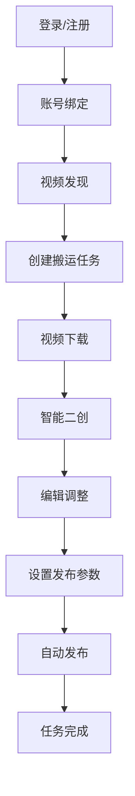

# 短视频搬运工具产品需求文档

## 1. 产品概述

短视频搬运工具是一个帮助用户自动化搬运、编辑和发布短视频内容的平台。通过集成多个短视频平台API，实现视频内容的发现、下载、二次创作和自动发布功能。

目标用户：内容创作者、自媒体运营者、短视频营销人员。产品帮助用户节省手动搬运和发布视频的时间，提高工作效率。

## 2. 核心功能

### 2.1 用户角色

| 角色 | 注册方式 | 核心权限 |
|------|----------|----------|
| 普通用户 | 邮箱注册 | 基础视频搬运功能，每日限10个视频 |
| 高级用户 | 付费升级 | 无限制搬运，高级编辑功能，批量操作 |
| 管理员 | 后台创建 | 系统管理，用户管理，数据统计 |

### 2.2 功能模块

本产品包含以下主要页面：
1. **仪表盘页面**：数据概览、任务状态、系统通知
2. **账号管理页面**：平台账号绑定、账号状态管理
3. **视频发现页面**：热门视频搜索、关键词筛选、视频预览
4. **任务管理页面**：搬运任务创建、进度跟踪、历史记录
5. **视频编辑页面**：视频裁剪、水印添加、滤镜处理、字幕生成
6. **发布管理页面**：发布设置、定时发布、发布历史
7. **设置中心页面**：系统配置、API密钥管理、存储设置

### 2.3 页面详情

| 页面名称 | 模块名称 | 功能描述 |
|----------|----------|----------|
| 仪表盘页面 | 数据概览 | 显示今日搬运数量、成功/失败率、平台分布统计 |
| 仪表盘页面 | 任务状态 | 实时显示进行中任务、队列状态、预计完成时间 |
| 账号管理页面 | 平台账号绑定 | 支持抖音、快手、小红书、B站等平台账号授权 |
| 账号管理页面 | 账号状态监控 | 显示账号健康状态、粉丝数、发布权限 |
| 视频发现页面 | 热门视频搜索 | 按平台、分类、热度筛选目标视频 |
| 视频发现页面 | 关键词筛选 | 支持多关键词组合搜索，排除词设置 |
| 任务管理页面 | 任务创建 | 选择目标视频、设置搬运参数、选择目标平台 |
| 任务管理页面 | 进度跟踪 | 实时显示下载进度、处理进度、发布进度 |
| 视频编辑页面 | 视频裁剪 | 支持时间轴裁剪、片段选择、时长调整 |
| 视频编辑页面 | 水印处理 | 添加/去除水印，支持文字和图片水印 |
| 视频编辑页面 | 智能二创 | 自动生成字幕、添加滤镜、调整播放速度 |
| 发布管理页面 | 发布设置 | 设置标题、描述、标签、封面图 |
| 发布管理页面 | 定时发布 | 支持预约发布时间、批量定时发布 |
| 设置中心页面 | API配置 | 管理各平台API密钥、调用频率限制 |
| 设置中心页面 | 存储设置 | 配置视频存储方式、清理策略、备份设置 |

## 3. 核心流程

### 用户操作流程
1. 用户注册登录后，首先绑定目标平台账号
2. 在视频发现页面搜索想要搬运的视频内容
3. 选择目标视频并创建搬运任务
4. 系统自动下载视频并进行智能二创处理
5. 用户可在编辑页面进行个性化调整
6. 设置发布参数并执行自动发布
7. 在任务管理页面跟踪执行进度和结果

## 4. 用户界面设计

### 4.1 设计风格
- **主色调**：科技蓝(#1890ff)搭配深空灰(#141414)
- **按钮样式**：圆角矩形，主要操作为实心填充，次要操作为边框样式
- **字体**：主标题使用PingFang SC，正文字体使用-apple-system
- **布局风格**：左侧导航栏 + 右侧内容区的经典后台布局
- **图标风格**：使用Ant Design图标库，保持简洁线性风格

### 4.2 页面设计概述

| 页面名称 | 模块名称 | UI元素 |
|----------|----------|--------|
| 仪表盘页面 | 数据卡片 | 使用渐变色背景的数字卡片，显示关键指标 |
| 视频发现页面 | 视频网格 | 卡片式布局，显示视频缩略图、标题、作者信息 |
| 任务管理页面 | 任务列表 | 表格展示，包含进度条、状态标签、操作按钮 |
| 视频编辑页面 | 编辑工具栏 | 顶部工具栏，左侧视频预览，右侧属性面板 |
| 发布管理页面 | 发布队列 | 时间轴形式展示待发布内容，支持拖拽调整顺序 |

### 4.3 响应式设计
- 桌面端优先设计，支持1280px以上分辨率
- 平板端适配，关键功能在768px以上正常显示
- 移动端提供核心功能的简化版本，支持基本任务管理
- 所有交互元素考虑触摸操作的友好性

## 5. 功能优先级和版本规划

### V1.0版本（MVP）
- 基础账号管理和视频发现功能
- 简单的视频下载和基础编辑
- 支持2-3个主流平台的自动发布
- 基础数据统计和任务管理

### V1.5版本
- 智能二创功能增强
- 支持更多平台接入
- 批量操作和定时发布
- 高级用户权限管理

### V2.0版本
- AI驱动的内容推荐
- 高级视频处理算法
- 多账号矩阵管理
- 数据分析和优化建议