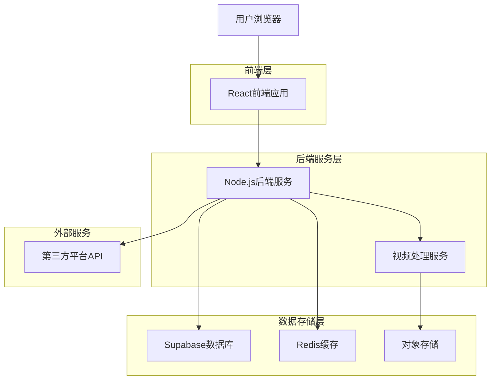
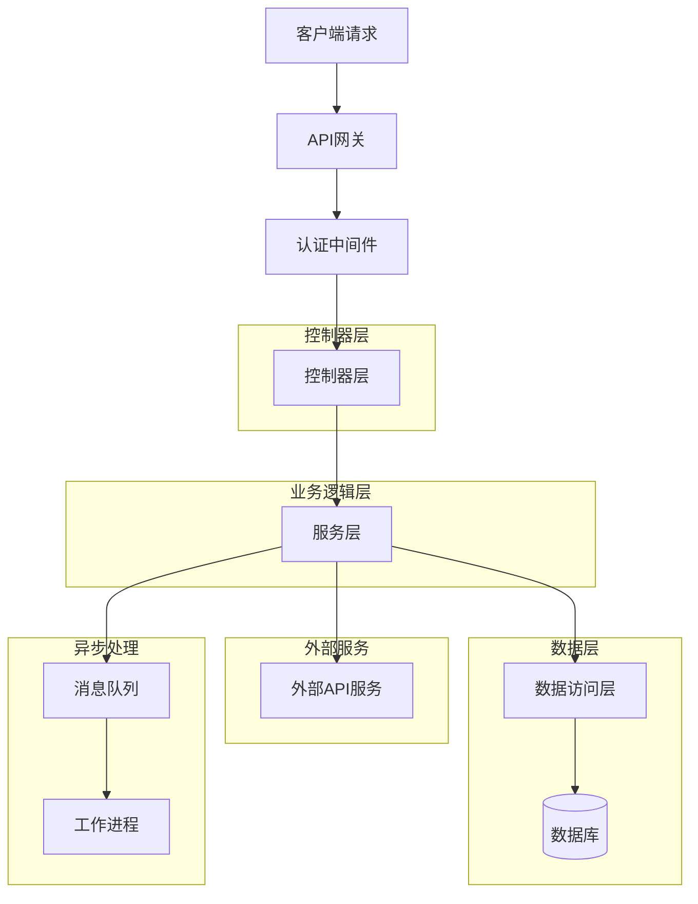
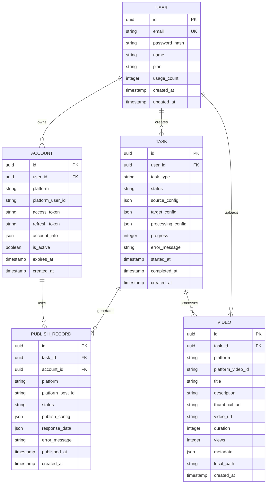

# 短视频搬运工具技术架构文档

## 1. 架构设计



## 2. 技术栈描述

- **前端**: React@18 + TypeScript + Ant Design@5 + Vite
- **后端**: Node.js@18 + Express@4 + TypeScript
- **数据库**: Supabase (PostgreSQL)
- **缓存**: Redis@7
- **文件存储**: Supabase Storage + AWS S3
- **消息队列**: Bull Queue (Redis-based)
- **视频处理**: FFmpeg + Sharp
- **部署**: Docker + Docker Compose

## 3. 路由定义

| 路由 | 用途 |
|------|------|
| / | 登录页面 |
| /dashboard | 仪表盘首页 |
| /accounts | 账号管理页面 |
| /discover | 视频发现页面 |
| /tasks | 任务管理页面 |
| /editor/:id | 视频编辑页面 |
| /publish | 发布管理页面 |
| /settings | 系统设置页面 |
| /profile | 用户资料页面 |

## 4. API定义

### 4.1 认证相关API

```
POST /api/auth/login
```

请求参数：
| 参数名 | 参数类型 | 是否必需 | 描述 |
|--------|----------|----------|------|
| email | string | true | 用户邮箱 |
| password | string | true | 用户密码 |

响应参数：
| 参数名 | 参数类型 | 描述 |
|--------|----------|------|
| token | string | JWT令牌 |
| user | object | 用户信息 |

### 4.2 账号管理API

```
GET /api/accounts
POST /api/accounts/bind
PUT /api/accounts/:id
DELETE /api/accounts/:id
```

### 4.3 视频发现API

```
GET /api/videos/discover
GET /api/videos/search
GET /api/videos/:id
```

请求参数（搜索）：
| 参数名 | 参数类型 | 是否必需 | 描述 |
|--------|----------|----------|------|
| platform | string | false | 平台名称 |
| keyword | string | false | 搜索关键词 |
| category | string | false | 视频分类 |
| limit | number | false | 返回数量限制 |

### 4.4 任务管理API

```
POST /api/tasks/create
GET /api/tasks
GET /api/tasks/:id
PUT /api/tasks/:id/status
DELETE /api/tasks/:id
```

### 4.5 视频处理API

```
POST /api/videos/download
POST /api/videos/process
POST /api/videos/upload
```

### 4.6 发布管理API

```
POST /api/publish/schedule
POST /api/publish/immediate
GET /api/publish/history
```

## 5. 服务器架构设计



## 6. 数据模型

### 6.1 实体关系图



### 6.2 数据库表结构

**用户表 (users)**
```sql
CREATE TABLE users (
    id UUID PRIMARY KEY DEFAULT gen_random_uuid(),
    email VARCHAR(255) UNIQUE NOT NULL,
    password_hash VARCHAR(255) NOT NULL,
    name VARCHAR(100) NOT NULL,
    plan VARCHAR(20) DEFAULT 'free' CHECK (plan IN ('free', 'premium', 'enterprise')),
    usage_count INTEGER DEFAULT 0,
    max_daily_tasks INTEGER DEFAULT 10,
    created_at TIMESTAMP WITH TIME ZONE DEFAULT NOW(),
    updated_at TIMESTAMP WITH TIME ZONE DEFAULT NOW()
);
```

**账号表 (accounts)**
```sql
CREATE TABLE accounts (
    id UUID PRIMARY KEY DEFAULT gen_random_uuid(),
    user_id UUID REFERENCES users(id) ON DELETE CASCADE,
    platform VARCHAR(50) NOT NULL CHECK (platform IN ('douyin', 'kuaishou', 'xiaohongshu', 'bilibili', 'wechat')),
    platform_user_id VARCHAR(255) NOT NULL,
    username VARCHAR(255),
    access_token TEXT,
    refresh_token TEXT,
    account_info JSONB,
    is_active BOOLEAN DEFAULT true,
    expires_at TIMESTAMP WITH TIME ZONE,
    created_at TIMESTAMP WITH TIME ZONE DEFAULT NOW(),
    updated_at TIMESTAMP WITH TIME ZONE DEFAULT NOW(),
    UNIQUE(user_id, platform, platform_user_id)
);
```

**任务表 (tasks)**
```sql
CREATE TABLE tasks (
    id UUID PRIMARY KEY DEFAULT gen_random_uuid(),
    user_id UUID REFERENCES users(id) ON DELETE CASCADE,
    task_type VARCHAR(50) NOT NULL CHECK (task_type IN ('download', 'process', 'publish', 'batch')),
    status VARCHAR(50) NOT NULL CHECK (status IN ('pending', 'running', 'completed', 'failed', 'cancelled')),
    source_config JSONB NOT NULL,
    target_config JSONB,
    processing_config JSONB,
    progress INTEGER DEFAULT 0 CHECK (progress >= 0 AND progress <= 100),
    error_message TEXT,
    started_at TIMESTAMP WITH TIME ZONE,
    completed_at TIMESTAMP WITH TIME ZONE,
    created_at TIMESTAMP WITH TIME ZONE DEFAULT NOW(),
    updated_at TIMESTAMP WITH TIME ZONE DEFAULT NOW()
);
```

**视频表 (videos)**
```sql
CREATE TABLE videos (
    id UUID PRIMARY KEY DEFAULT gen_random_uuid(),
    task_id UUID REFERENCES tasks(id) ON DELETE CASCADE,
    platform VARCHAR(50) NOT NULL,
    platform_video_id VARCHAR(255) NOT NULL,
    title TEXT,
    description TEXT,
    thumbnail_url TEXT,
    video_url TEXT,
    local_path TEXT,
    duration INTEGER,
    file_size BIGINT,
    views INTEGER DEFAULT 0,
    likes INTEGER DEFAULT 0,
    comments INTEGER DEFAULT 0,
    metadata JSONB,
    created_at TIMESTAMP WITH TIME ZONE DEFAULT NOW(),
    UNIQUE(platform, platform_video_id)
);
```

**发布记录表 (publish_records)**
```sql
CREATE TABLE publish_records (
    id UUID PRIMARY KEY DEFAULT gen_random_uuid(),
    task_id UUID REFERENCES tasks(id) ON DELETE CASCADE,
    account_id UUID REFERENCES accounts(id) ON DELETE CASCADE,
    platform VARCHAR(50) NOT NULL,
    platform_post_id VARCHAR(255),
    title TEXT,
    description TEXT,
    tags TEXT[],
    cover_image_url TEXT,
    video_url TEXT,
    status VARCHAR(50) NOT NULL CHECK (status IN ('pending', 'publishing', 'published', 'failed')),
    publish_config JSONB,
    response_data JSONB,
    error_message TEXT,
    scheduled_at TIMESTAMP WITH TIME ZONE,
    published_at TIMESTAMP WITH TIME ZONE,
    created_at TIMESTAMP WITH TIME ZONE DEFAULT NOW(),
    updated_at TIMESTAMP WITH TIME ZONE DEFAULT NOW()
);
```

## 7. 第三方平台集成

### 7.1 抖音开放平台
- **API版本**: v1.0
- **认证方式**: OAuth 2.0
- **主要接口**:
  - 视频上传: `/video/upload/`
  - 视频信息获取: `/video/data/`
  - 用户视频列表: `/video/list/`

### 7.2 快手开放平台
- **API版本**: v3.0
- **认证方式**: OAuth 2.0
- **主要接口**:
  - 视频上传: `/openapi/photo/publish/`
  - 视频信息获取: `/openapi/photo/info/`
  - 用户作品列表: `/openapi/photo/list/`

### 7.3 小红书开放平台
- **API版本**: v1.0
- **认证方式**: OAuth 2.0
- **主要接口**:
  - 笔记发布: `/api/notes/create/`
  - 笔记信息获取: `/api/notes/info/`
  - 用户笔记列表: `/api/notes/user/`

## 8. 视频处理技术方案

### 8.1 视频下载
- **技术方案**: 使用yt-dlp库进行视频下载
- **格式支持**: MP4, MOV, AVI, FLV
- **质量选项**: 720p, 1080p, 4K
- **并发控制**: 最多3个同时下载任务

### 8.2 视频处理
- **裁剪**: FFmpeg进行精确到秒的视频裁剪
- **转码**: 统一转换为H.264编码的MP4格式
- **压缩**: 智能压缩算法，保持画质同时减小文件大小
- **水印**: 支持文字水印和图片水印，可调节透明度

### 8.3 智能二创
- **字幕生成**: 使用Whisper进行语音转文字
- **滤镜效果**: 提供10+种预设滤镜效果
- **倍速播放**: 支持0.5x-2x速度调整
- **背景音乐**: 支持添加版权音乐库

## 9. 安全性和合规性

### 9.1 数据安全
- **加密存储**: 用户密码使用bcrypt加密
- **API密钥**: 敏感信息使用AES-256加密存储
- **访问控制**: 基于JWT的权限验证
- **数据备份**: 每日自动备份数据库

### 9.2 合规性考虑
- **版权声明**: 提醒用户尊重原创内容版权
- **平台规则**: 遵守各平台的内容发布规范
- **用户协议**: 明确用户责任和平台义务
- **隐私保护**: 遵循GDPR等隐私保护法规

### 9.3 系统安全
- **限流控制**: API调用频率限制，防止滥用
- **输入验证**: 严格的参数校验和SQL注入防护
- **日志监控**: 完整的操作日志和异常监控
- **HTTPS**: 全站HTTPS加密传输